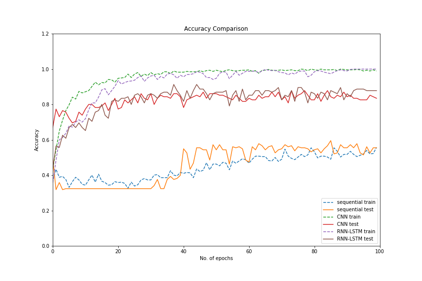

# Speech emotion recognition
There is a drastic increase in the use of voice controlled devices like Amazon Alexa, Google Assitant and Apple Siri these days. If there is a way to provide additional information behind the human commands, these devices will be able to give a more personalised response to our requests. The Speech emotion recognition is a step in this direction.

Deep learning techniques are used to extract the emotion from a voice clip. The Ravdess dataset from Kaggle is used for training the model. The model classifies the emotion in the audio into one of the three categories: Happy, Calm and Angry.

The following plot shows the accuracy comparison between different models on test and train data.

